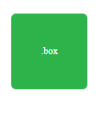
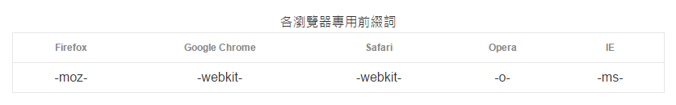

# CSS Transition

在CSS3之前的轉場特效，都是立即完成的，覽者並沒有辦法感受到這兩種外觀中間平滑的轉換，造成了視覺上的不適，轉場特效就提供了更為豐富的動畫效果。

當網頁有使用到 CSS3 Transition 馬上就會讓你的網站帥十倍啦！（但本人並不會因此帥十倍^\_^）

使用方法：

| 屬性 | 說明 |
| :--- | :--- |
| Selectesd Property | 指定 transition 效果所要控制的屬性。 |
| Animation duration | 指定多少時間完成 transition 效果。 |
| Animation Type | 指定 transition 的速度效果。 |
| Animation delay | 指定 transition 效果的開始時間。 |

* Selectesd Property：如果Selectesd Property定義為all，就會自動偵測所有可進行動畫的屬性哦！
* Animation duration：通常以s為單位\(秒\)，可以定義小數點例如0.5s或.5s，預設值是0s。
* Animation Type：時間函式，這是用來設定轉場過程時所使用的貝茲曲線。內建的幾個可直接使用數值如下，直接使用名稱就可以取用。

> 什麼是貝茲曲線？ 
>
>
>
> 
>
> * linear：均速
> * ease：先快後慢
> * ease-in：加速
> * ease-out：減速
> * ease-in-out：較平緩的 `ease`
> * step-start
> * step-end
> * steps\(\)
> * cubic-bezier\(\)
>
> Demo：[https://developer.mozilla.org/en-US/docs/Web/CSS/transition-timing-function](https://developer.mozilla.org/en-US/docs/Web/CSS/transition-timing-function)

最簡單的背景顏色transition示範：

[https://codepen.io/fukuball/pen/domeOo](https://codepen.io/fukuball/pen/domeOo/)

## ex. css-transition 練習

CSS transition被大量運用在網頁元素hover時的效果 

練習一

練習二：練習購物網站時常出現的效果。

## 供應商前綴字\(Vendor Prefixes\)

由於瀏覽器不同品牌的廠商，搶先於標準完成前就開始發佈已包含實作功能造成的結果。因為有些CSS屬性有可能在瀏覽器中是屬於實驗性質的，所以在前面加上了瀏覽器供應商的前綴字，代表是要開啟這個實驗性的CSS屬性。

