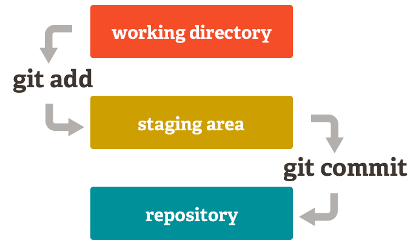
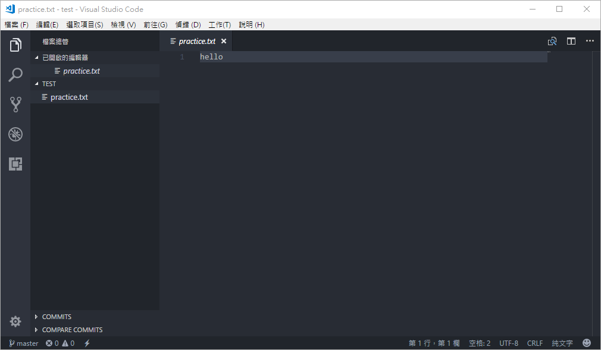

# Git檔案狀態



新建的檔案和更動過的檔案會進入紅色區，經由 **git add** 指令進入**等待提交**的黃色區。

**git commit**後，檔案便置於儲存區\(Repo\)，這些放在儲存區的檔案即是**已提交**的狀態。

暨上一篇建立的test專案，我們在之中加入一文字檔來做練習。

```text
$ touch practice.txt
```

接著查看Git狀態

```text
$ git status
```


可以看到，剛才新建的practice.txt這份檔案現在處於未被追蹤\(Untracked\)的狀態。

接著讓我們將這份檔案加入staging area。

```text
$ git add practice.txt
```

> git add後接要加入的檔案，如有多個檔案且要全部加入時使用 `$ git add .`

再查看一次git status


會發現practice已經被加入Git的追蹤之中了。

讓我們來提交一次看看！

```text
$ git commit -m "新建practice.txt檔案"
$ git status
```

> git commit 不加 -m 會發生什摸事？會進入vim模式，可編輯多行的commit指令。


可以看到因為更動過的檔案已經提交\(commit\)，所以staging area就被清空囉！

讓我們編輯看看檔案吧！輸入文字後儲存，接著再次查看git status


可以看到檔案因為被更動了，所以又出現在紅色區囉～

