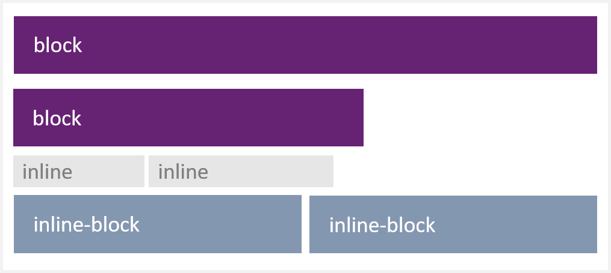

# CSS文字、背景、表格、display

## 文字

| 屬性 | 說明 |
| :--- | :--- |
| color | 設定文字顏色 |
| text-align | 設定文字對齊：right、center、left |
| font-size | 設定文字大小 |
| font-weight | 設定文字加粗 |
| font-family | 設定字體 |
| text-decoration | 設定文字裝飾：underline、none、overline、line-through |

## 背景

| 屬性 | 說明 |
| :--- | :--- |
| background | 將背景屬性一次設定。 |
| background-color | 背景顏色 |
| background-image | 背景圖片 |
| background-position | 背景圖片位置：center、top、bottom、right、left |
| background-repeat | 背景圖片是否重複：repeat、repeat-x、repeat-y、no-repeat |
| background-attachment | 背景圖片是否固定或滾動：scroll、fixed |

### background-image

```css
body {background-image: url(/assets/bg.png);}
```

### background-repeat

```css
body {
  background-image: url(/assets/bg.png);
  background-repeat: no-repeat;
}
```

### background-position

```css
body {
  background-image: url(/assets/bg.png);
  background-repeat: no-repeat;
  background-position:center;
}
```

也可以只用百分比值或長度值。

```css
body {
  background-image: url(/assets/bg.png);
  background-repeat: no-repeat;
  background-position:50px 100px;
}
```

### background-attachment

```css
body {
  background-image: url(/assets/bg.png);
  background-repeat: no-repeat;
  background-attachment:fixed
}
```

## 表格

### 邊框：border

```css
table, td, th
{
  border:1px solid green;
}
```

## display

每個 HTML 元素都有一個預設的 display 值，大部分元素的 display 屬性，預設值通常是 block 或 inline 其中一個。

| 屬性 | 說明 |
| :--- | :--- |
| none | 此元素不會被顯示。 |
| block | 此元素將顯示為區塊元素，且前後會帶有換行。 |
| inline | 預設。行内元素。 |
| inline-block | 行内區塊元素。 |
| list-item | 此元素會作為列表顯示。 |



