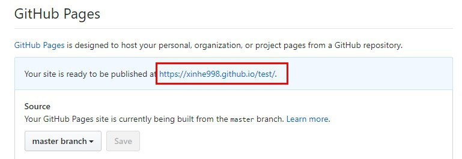

# ex. 練習作業


> 1. div如何設定CSS水平置中呢？
>
>    ```css
>    margin: 0 auto;
>    ```
>
> 2. 請使用列表方式製作上方menu
>
>    ```markup
>    <ul>
>        <li>
>            <a href="#">HOME</a>
>        </li>
>    </ul>
>    ```
>
> 3. 如何讓menu並排顯示？
>
>    ```css
>    display: inline-block;
>    ```
>
> 4. 如何隱藏li的圓點？
>
>    ```css
>    li {
>        list-style: none;
>    }
>    ```

[https://github.com/Xinhe998/nutc-html-css-practice](https://github.com/Xinhe998/nutc-html-css-practice)

完成後請發PR回本次練習作業哦！

必要commit：

* [ ] 完成Html架構
* [ ] 完成圖片引入
* [ ] 完成menu製作
* [ ] 完成內文
* [ ] 完成footer

## GitHub Page 建立靜態網頁

作業push到github上之後 可以按Settings &gt; GitHub Pages 選擇master branch &gt; Save




作業就會產生一個網址囉～

假如你的html檔名是index.html

那麼就可以到【你的github page網址】/index.html看到你的作業！

