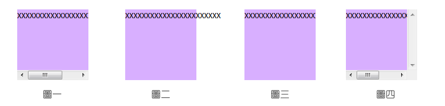

# 關於 CSS 位置

## position

- static:
原預設值，不會被特別被定位在某地方，而是照著瀏覽器原本的位置( 無法設定top、bottom、left、和 right 的值)。

- relative:
基本上，如果沒有特定設定top、right、bottom、left來定義他的位置，
也是照著瀏覽器原本的位置。

- absolute:
這是在做網頁設計時，很廣泛被使用的語法，通常會和relative一起使用。
會在除了static以外的第一個父元素定位，
當使用者將網頁往下拉時，**元素也會跟著改變位置**。
通常會用在圖片做遮罩，或是寫文字使用。

- fixed:
元素會依照top、right、bottom、left設定而被固定在某個位置，而當使用者將網頁往下拉時，**元素的位置不會改變**。

>每一個方向 (top, right, bottom, left) 的位置值可以是長度、百分比、或是 auto。

## overflow

用來設定當內容放不下時的處理方式。

- visible: 內容放不下也顯示出。
- hidden: 放不下的內容就不顯示出來。
- scroll: 無論內容放得下放不下，都加入上下捲軸及左右捲軸的功能。
- auto: 當內容放不下時，加上捲軸的功能。

## z-index

用來決定元素重疊的順序。z-index 值比較大個元素會被放在上面。

