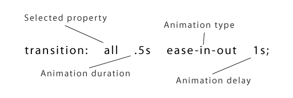

# CSS transitio 轉場

在CSS3之前的轉場特效，都是立即完成的，覽者並沒有辦法感受到這兩種外觀中間平滑的轉換，造成了視覺上的不適，轉場特效就提供了更為豐富的動畫效果。

當網頁有使用到 CSS3 Transition 馬上就會讓你的網站帥十倍啦！很爽吧！（但本人並不會因此帥十倍^_^）

使用方法：

| 屬性               | 說明                                 |
| ------------------ | ------------------------------------ |
| Selectesd Property | 指定 transition 效果所要控制的屬性。 |
| Animation duration | 指定多少時間完成 transition 效果。   |
| Animation Type     | 指定 transition 的速度效果。         |
| Animation delay    | 指定 transition 效果的開始時間。     |

- Selectesd Property：如果Selectesd Property定義為all，就會自動偵測所有可進行動畫的屬性哦！

- Animation duration：通常以s為單位(秒)，可以定義小數點例如0.5s或.5s，預設值是0s。

- Animation Type：時間函式，這是用來設定轉場過程時所使用的貝茲曲線。內建的幾個可直接使用數值如下，直接使用名稱就可以取用。

>什麼是貝茲曲線？
>

  - linear：均速
  - ease：先快後慢
  - ease-in：加速
  - ease-out：減速
  - ease-in-out：較平緩的 `ease`
  - step-start
  - step-end
  - steps()
  - cubic-bezier()

Demo：https://developer.mozilla.org/en-US/docs/Web/CSS/transition-timing-function

<iframe height='265' scrolling='no' title='domeOo' src='//codepen.io/fukuball/embed/domeOo/?height=265&theme-id=0&default-tab=css,result&embed-version=2' frameborder='no' allowtransparency='true' allowfullscreen='true' style='width: 100%;'>See the Pen <a href='https://codepen.io/fukuball/pen/domeOo/'>domeOo</a> by fukuball (<a href='https://codepen.io/fukuball'>@fukuball</a>) on <a href='https://codepen.io'>CodePen</a>.
</iframe>
