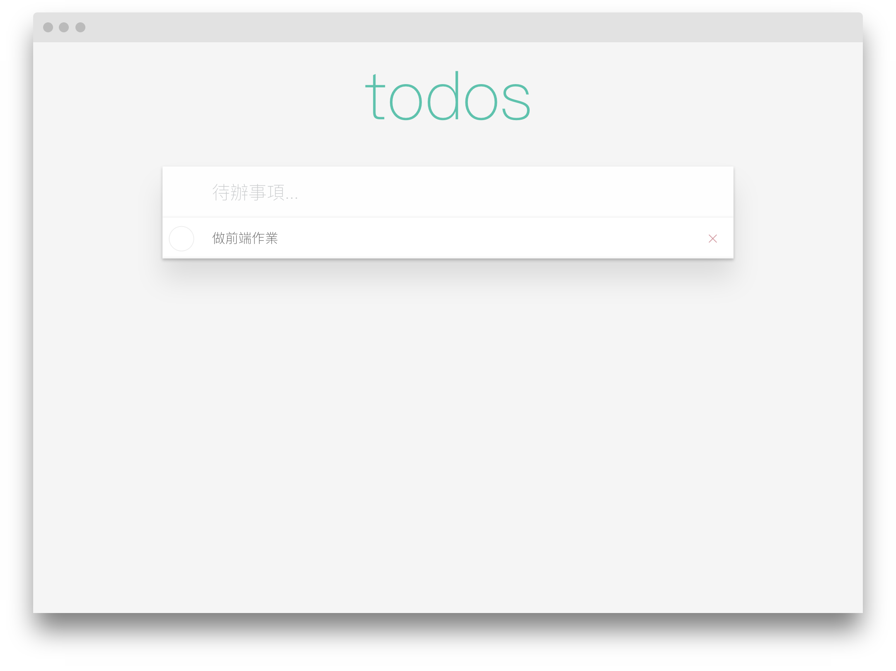
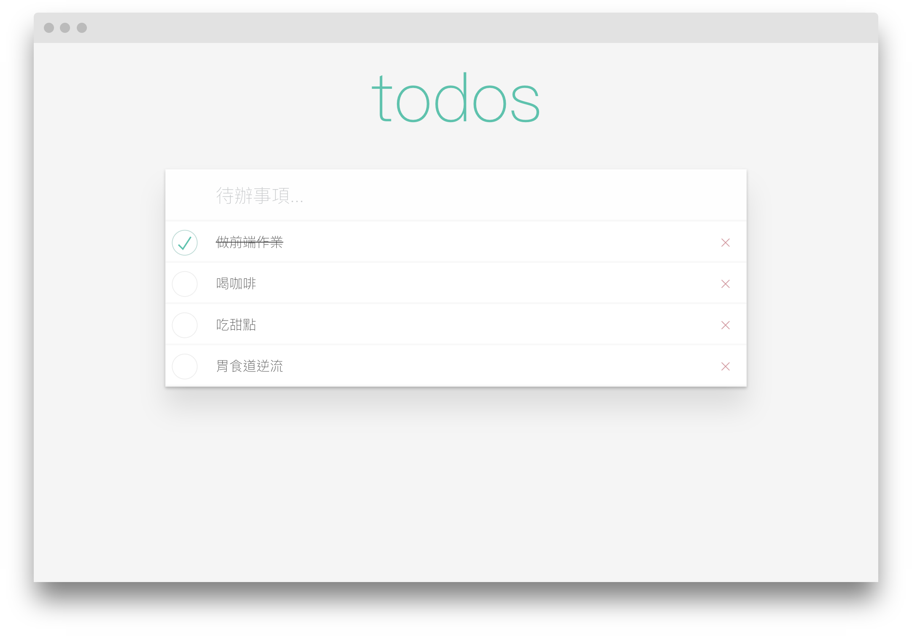

# ex. 練習作業

## JavaScript ToDo List 練習

本次作業repo：[https://github.com/Xinhe998/nutc-javascript-todolist-practice](https://github.com/Xinhe998/nutc-javascript-todolist-practice)

CSS樣式可以自己設計，完成後請發PR回本次練習作業哦！

